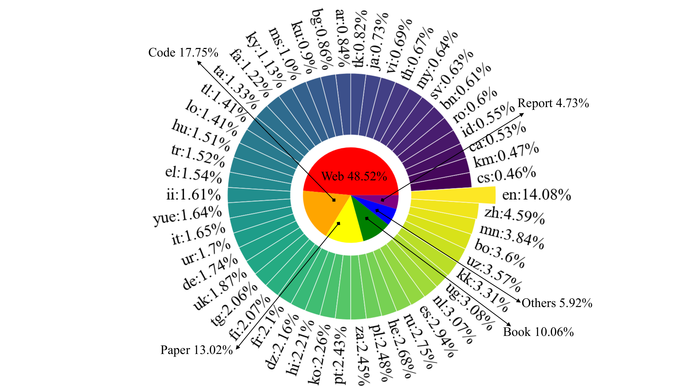

# VEEF-Multi-LLM: Effective Vocabulary Expansion and Parameter Efficient Finetuning Towards Multilingual Large Language Models

<p align='center'>
    
    <br>
    [<a href="https://huggingface.co/shajiu/VEEF-Multi-LLM">🤖 corpus</a>]
    [<a href="https://huggingface.co/shajiu/VEEF-Multi-LLM">⚡model</a>]
    [<a href="https://aclanthology.org/2025.coling-main.533">📚 paper</a>]
    <br>


  
### Abstract
Large Language Models(LLMs) have brought significant transformations to various aspects of human life and productivity. However, the heavy reliance on vast amounts of data in developing these models has resulted in a notable disadvantage for low-resource languages, such as Nuosu and others, which lack large datasets. Moreover, many LLMs exhibit significant performance discrepancies between high-and lowresource languages, thereby restricting equitable access to technological advances for all linguistic communities. To address these challenges, this paper propose a low-resource multilingual large language model, termed VEEF-Multi-LLM, constructed through effective vocabulary expansion and parameter-efficient fine-tuning. We introduce a series of innovative methods to address challenges in low-resource languages. First, we adopt Byte-level Byte-Pair Encoding to expand the vocabulary for broader multilingual support. We separate input and output embedding weights to boost performance, and apply RoPE for long-context handling, as well as RMSNorm for efficient training. To generate high-quality supervised fine-tuning (SFT) data, we use self-training and selective translation, and refine the resulting dataset with the assistance of native speakers to ensure cultural and linguistic accuracy. Our model, VEEF-Multi-LLM-8B, is trained on 600 billion tokens across 50 natural and 16 programming languages. Experimental results show that the model excels in multilingual instruction-following tasks, particularly in translation, outperforming competing models in benchmarks such as XCOPA and XStoryCloze. Although it lags slightly behind English-centric models in some tasks (e.g., m-MMLU), it prioritizes safety, reliability, and inclusivity, making it valuable for diverse linguistic communities. We open-source our models on GitHub and Huggingface.


### Citation
```bib
@inproceedings{sha2025veef,
  title={VEEF-Multi-LLM: Effective Vocabulary Expansion and Parameter Efficient Finetuning Towards Multilingual Large Language Models},
  author={Sha, Jiu and Zhu, Mengxiao and Feng, Chong and Shang, Yuming},
  booktitle={Proceedings of the 31st International Conference on Computational Linguistics},
  pages={7963--7981},
  year={2025}
}
```
